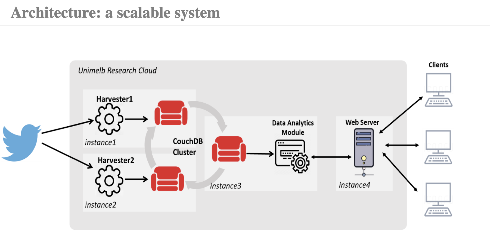

# COMP90024_A2

###########################################################################################
**Project:** COMP90024--2020S1--Assignment2  
**Title:** Alcohol Tweets and Australian Cities Analytics on the Cloud  
**Purpose:**  to find out the correlations between alcohol-related tweets and demographic and behavioural characteristics in Australia cities.  
**Team:** group05  
**Member:**  
&emsp;Ruiqi Zhu (939162)  
&emsp;Zhengyang Li (952972)  
&emsp;Jianxin Xu (1014840)  
&emsp;Qiuxia YIN (1017231)  
&emsp;Fang Qu (1070888)  
###########################################################################################

### System Architecture
